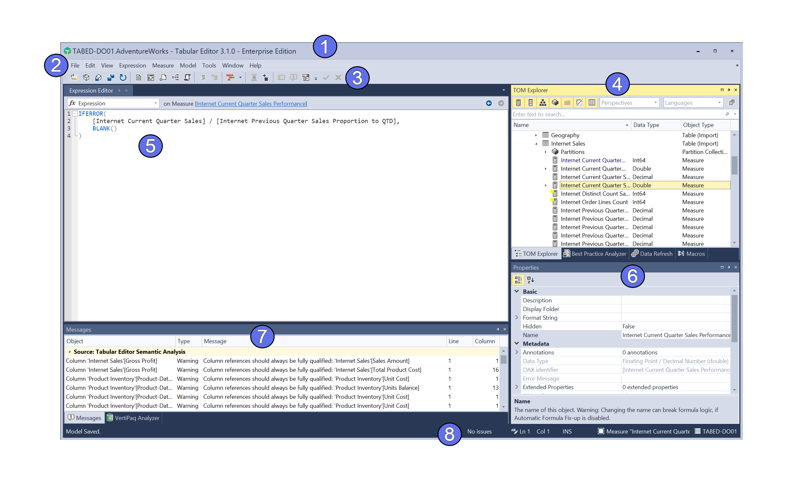
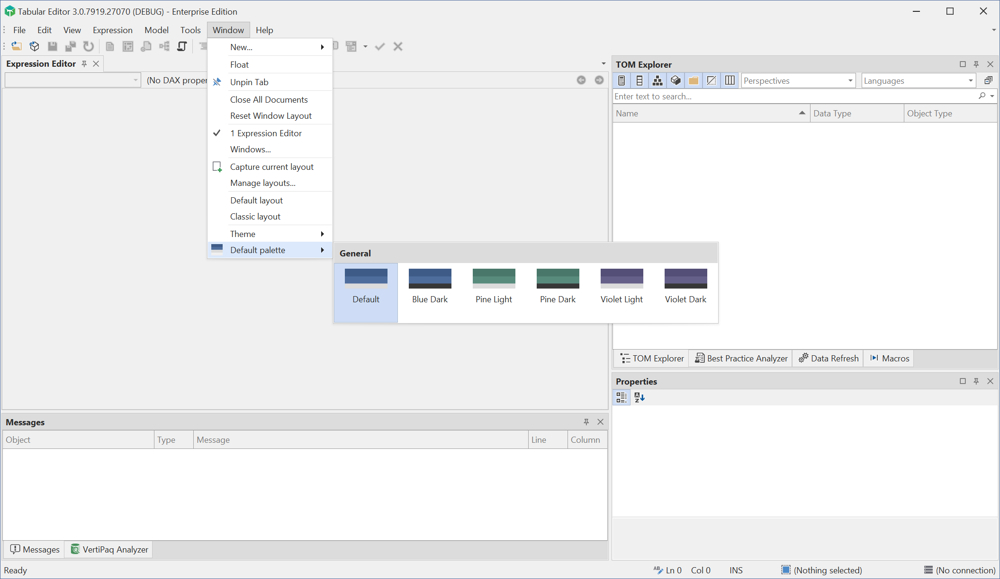

# Interface overview

This article describes the user interface of Tabular Editor 3.

## Basic user interface elements

The first time you launch Tabular Editor 3 and load a data model, you will be presented with an interface as shown on the screenshot below.

1. **Title bar**: This shows the name or the currently loaded file and Analysis Services database or Power BI dataset if connected.
2. **Menu bar**: The menu bar provides access to all of the various features of Tabular Editor 3. See [Menus](#menus) for a detailed walkthrough of all menu options.
3. **Toolbars**: The toolbars provide quick access to the most commonly used features. All features accessible through the toolbar can also be accessed through the menus. You may customize the toolbars and their buttons under **Tools > Customize...**
4. **TOM Explorer view**: A hierarchichal view of the [Tabular Object Model (TOM)](https://docs.microsoft.com/en-us/analysis-services/tom/introduction-to-the-tabular-object-model-tom-in-analysis-services-amo?view=asallproducts-allversions) metadata that represents your data model. The toggle buttons at the top allow you to filter which objects are displayed. The search box allows you to filter objects by names.
5. **Expression Editor**: The expression editor provides a quick way to edit any DAX, SQL or M expressions of the currently selected object in the TOM Explorer. If you close the expression editor, you can bring it back up by double-clicking on an object in the TOM Explorer. The dropdown at the top allows you to switch between different expression properties, in case the currently selected object has more than one such property (for example, KPIs have Target Expressions, Status Expressions and Trend Expressions, which are 3 different DAX expressions belonging to the same KPI object).
6. **Properties view**: A detailed view of all TOM properties available on the currently selected object(s) in the TOM Explorer. Most properties can be edited through the grid, even when multiple objects are selected. Some properties (such as "Format String", "Connection String", "Role Members") have popup dialogs or collection editors that can be brought up by clicking on the ellipsis button within the property value cell.
7. **Messages view**: Tabular Editor 3 continuously analyzes the DAX expressions on your model for semantic errors. Any such errors are outputted here. In addition, messages shown in this view, can originate from C# scripts or from error messages reported by Analysis Services.
8. **Status bar**: The status bar provides various contextual information about the current selection, Best Practice Analyzer findings, etc.

## Customizing the user interface

All UI elements may be resized and/or rearranged to fit your needs. You can even drag individual views out of the main view, thus splitting up an instance of Tabular Editor 3 across multiple monitors. Tabular Editor 3 will save the customization when the application is closed, and reload it automatically upon next launch.

### Choosing a different layout

To reset the application to the default layout, choose the **Window > Default layout** option. Users of Tabular Editor 2.x may prefer the **Window > Classic layout** option which places the TOM Explorer on the left side of the screen, and the Properties view below the Expression Editor.

Use the **Window > Capture current layout..." option to save a customized layout such that it will become available as a new layout option within the Window menu, allowing you to quickly switch back and forth between different layouts. Use the **Window > Manage layouts...** option to bring up a list of all available layouts, allowing you to rename, save, delete layouts, etc. When saving a layout to disk, the result is an .xml file which you can share with other users of Tabular Editor 3.

### Changing themes and palettes

The visual appearance of Tabular Editor 3 can be changed by choosing a different theme and/or palette. Tabular Editor 3 ships with five different themes (sometimes called "skins"), available through the **Window > Themes** menu:

- Basic and Bezier (vector based, works well on high-DPI displays)
- Blue, Dark and Light (raster based, not recommended for high-DIP Displays)

For the vector based themes (Basic and Bezier), use the **Window > Palette** menu option to change the colors used by the theme.

## Menus

The following section describes the menus in Tabular Editor 3 in more details (WIP).

### File

### Edit

### View

### Model

### Tools

### Window

### Help

### Dynamic menus (context dependent)

#### Expression

#### Query

#### DAX Script

#### C# Script

#### Pivot Grid

#### Table Preview
