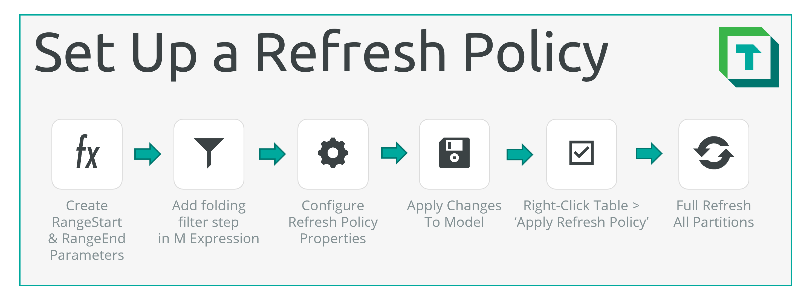

# Setting up Incremental Refresh

<br></br>



<br></br>

To set up Incremental Refresh, you must configure a new Refresh Policy for the table. This is easily done by configuring the Refresh Policy properties once _EnableRefreshPolicy_ is set to `True`:

<br></br>

## Set up from scratch with Tabular Editor

1. __Connect to the model:__ Connect to the Power BI XMLA endpoint of your workspace, and open the dataset upon which you want to configure Incremental Refresh.
2. __Create the `RangeStart` and `RangeEnd` Parameters:__ Incremental refresh requires the `RangeStart` and `RangeEnd` parameters to be created ([more information](https://docs.microsoft.com/en-us/power-bi/connect-data/incremental-refresh-configure#create-parameters)). Add two new Shared Expressions in Tabular Editor:

  <br></br>

  

  <br></br>

3. __Configure the `RangeStart` and `RangeEnd` Parameters:__ Name them `RangeStart` and `RangeEnd` respectively, set their `Kind` property to "M" and set their expression to the following (the actual date/time value you specify doesn't matter, as it will be set by Power BI Service when starting the data refresh):

  ```M
  #datetime(2021, 6, 9, 0, 0, 0) 
    meta 
      [
        IsParameterQuery=true, 
        Type="DateTime", 
        IsParameterQueryRequired=true
      ]
  ```

4. __Enable the Table Refresh Policy:__ Next, select the table for which you want to configure incremental refresh. In the _'Expression Editor' window, Select __'M Expression'__ from the dropdown, and alter the Power Query M Expression such that there is a filter step on the date column for which you will enable incremental refresh. 

  _An example of one such valid filter step is below:_
  
  ```M
  // The filter step must be able to fold back to the data source
  // No steps before this should break query folding
  #"Incremental Refresh Filter Step" = 
      Table.SelectRows(
          Navigation,
          each 
              [OrderDate] >= #"RangeStart" and 
              [OrderDate] < #"RangeEnd"
      )
  ```

  Columns that are of date, string or integer types can still be filtered while maintaining query folding using functions that convert `RangeStart` or `RangeEnd` to the appropriate data type. For more information about this, see [here](https://learn.microsoft.com/en-us/power-bi/connect-data/  incremental-refresh-overview#supported-data-sources)

5. __Enable the Table Refresh Policy:__ In the _'Properties'_ window, set the `EnableRefreshPolicy` property on the table to `True`:

  <br></br>

  

  <br></br>

6. __Configure Refresh Policy:__ Configure the remaining properties according to the incremental refresh policy you need. Remember to specify an M expression for the `SourceExpression` property (this is the expression that will be added to partititions created by the incremental refresh policy, which should use the `RangeStart` and `RangeEnd` parameters to filter the data in the source). The = operator should only be applied to either RangeStart or RangeEnd, but not both, as data may be duplicated.

    - __Source Expression:__ The M Expression that be added to partitions created by the Refresh Policy.
    - __IncrementalWindowGranularity:__ The granularity of the incremental (refresh) window.
    - __IncrementalWindowPeriods:__ # periods (of granularity specified above) wherein data should be refreshed.
    - __IncrementalWindowPeriodsOffset:__ Set to `-1` to set _'Only Refresh Complete Periods'_
    - __RollingWindowGranularity:__ The granularity of the rolling (archive) window.
    - __RollingWindowPeriods:__ # periods (of granularity specified above) wherein data should be archived.
    - __Mode:__ Whether it is standard `Import` Refresh Policy or `Hybrid`, where the last partition is DirectQuery.
    - __PollingExpression:__ A valid M Expression configured to detect data changes. For more information about _Polling Expression_ or other Refresh Policy properties, see [here](xref:incremental-refresh-about#overview-of-all-properties).
  
  <br></br>

  
  
  <br></br>

7. __Apply Model Changes:__ Save your model (Ctrl+S).
8. __Apply Refresh Policy:__ Right-click on the table and choose "Apply Refresh Policy".

  <br></br>
  
  

  <br></br>

  __That's it!__ At this point, you should see that the Power BI service has automatically generated the partitions on your table, based on the policy you specified. All that's left is to refresh all the partitions.

  <br></br>

  
  
  <br></br>

9. __Refresh all partitions:__ Shift-click to select all partitions. Right-click and select _Refresh > Full refresh (partition)_.

  <br></br>

  
  
  <br></br>