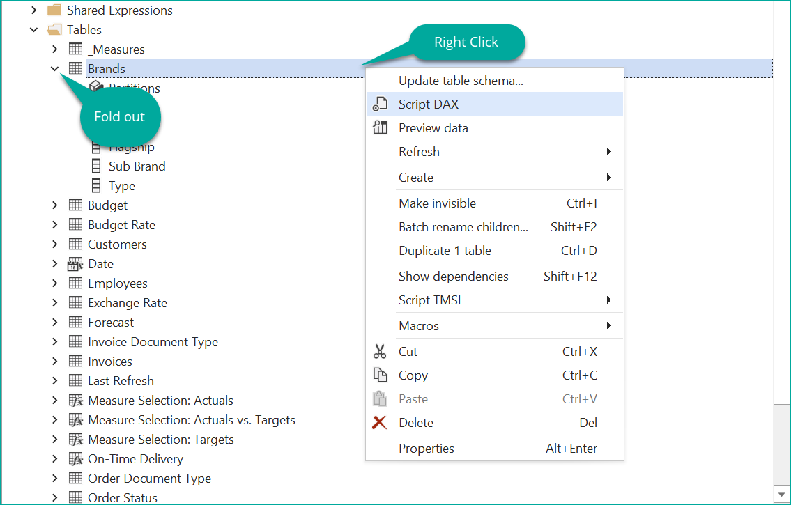
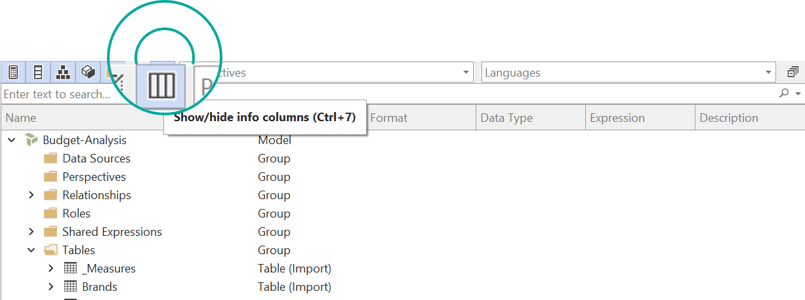

---
uid: tom-explorer-view
title: TOM Explorer view
author: Morten Lønskov
updated: 2023-02-21
applies_to:
  editions:
    - edition: Desktop
    - edition: Business
    - edition: Enterprise
---
# Using the TOM Explorer in Tabular Editor 3
The TOM Explorer is your main window for interacting with the objects of your data mode. Objects such has tables, columns, measures, security groups etc. are all displayed in a hierarchical structure. A Tabular data model is represented by the so called [Tabular Object Model (TOM)](https://docs.microsoft.com/en-us/analysis-services/tom/introduction-to-the-tabular-object-model-tom-in-analysis-services-amo?view=asallproducts-allversions) and it is the metadata of your TOM that is displayed in the TOM Explorer. 

The TOM Explorer consists of two main areas, firstly the data model objects and secondly the menu bar that allows for filtering and changing what is presented in the main window. 

  

## Data Model Objects
You can fold out objects in the TOM Explorer to see their children and follow the hierarchy of objects downwards. And if you right click on any object you will be given a list of options to interact with that specific object. As you can see bellow there are several options that you can use with a table. It is with this menu that you for example can easily refresh your tables and see the status of that refresh in the @data-refresh-view

> [!IMPORTANT]
> In Tabular Editor 3 Desktop Edition some options are disabled and greyed-out. This is due to the limitations of using Tabular Editor has an external tool. For more information see @desktop-limitations 

### Show Info Columns
The TOM Explorer allows for toggling on additional info columns about the data model objects. This can be done with the short cut `CTRL+7`
These extra info also exists in the property window, but allow for a quick view of the Object Type, Format String, Data Type, Expression and Description.

## TOM Explorer Toolbar
The toolbar allow you to show and hide different types of objects, toggling perspectives and languages ans well as searching for specific objects in the data model.

  

1. Show/Hide Measures `CTRL+1`
2. Show/Hide Columns `CTRL+2`
3. Show/Hide Hierarchies `CTRL+3`
4. Show/Hide Partitions `CTRL+4`
5. Show/Hide Display Folders `CTRL+5`
6. Show/Hide Hidden Objects `CTRL+6`
7. Show/Hide Info Columns `CTRL+7`
8. Fold out to choose a perspective of objects to see
9. Fold out see in a different language
10. Search within the TOM Explorer
